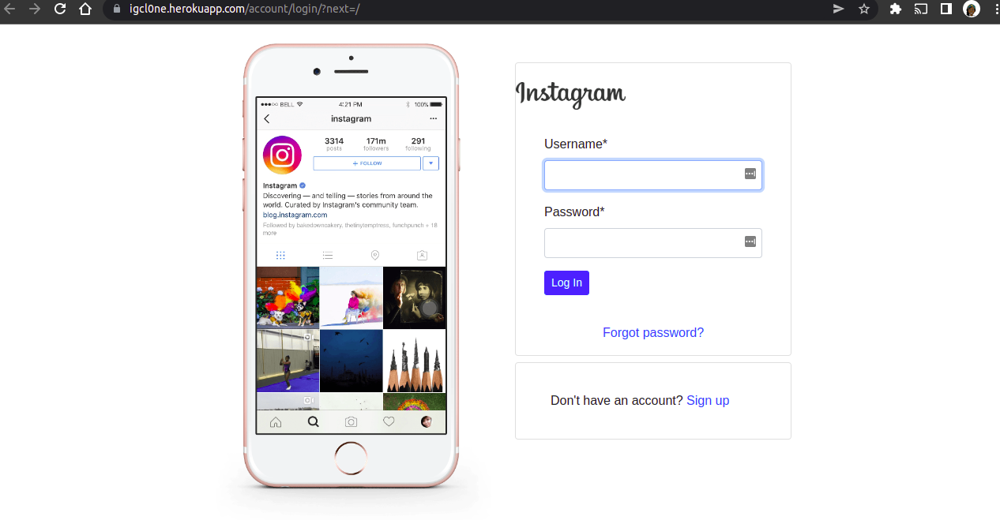

***

# Instagram Clone

---

## Author
> [Joyce Nguttu](https://github.com/joycodes)
***

## Description
>A clone of instagram that resembles the functionalities of instagram.




---

## User Story  
  
* Sign in to the application to start using.
* Upload my pictures to the application.
* See my profile with all my pictures.
* Follow other users and see their pictures on my timeline.
* Like a picture and leave a comment on it.  

---

## Live Link
[View Site](https://igcl0ne.herokuapp.com/)

***

## Setup/Installation Requirements
To get the code..
Cloning the repository:
 https://github.com/joycodes/instagram-clone.git
  
Move to the folder and install requirements
  ```bash
  cd Instagram
  pip install -r requirements.txt
  ```
Setup Configurations and  Database
  ```bash 
  python3 manage.py makemigrations instaclone 
  ``` 
Running the application
  ```bash
  python3 manage.py runserver
  ```
  
Testing the application
  ```bash
  python3 manage.py test
  ```
Open the application on your browser 
[127.0.0.1:8000](http://127.0.0.1:8000/)

---

## Dependencies
>* python3.8
>* Django 4.0.5
>* Virtual Environment
>* heroku
***
## Technologies Used
>* Bootstrap.
>* Python.
 
---

## Support and Contact Information
> The application is an open-source product if you  want to improve it or include an event of a bug  contact this
> https://www.linkedin.com/in/jnguttu/ .
***
## License
The project is [MIT](LICENSE) licensed 